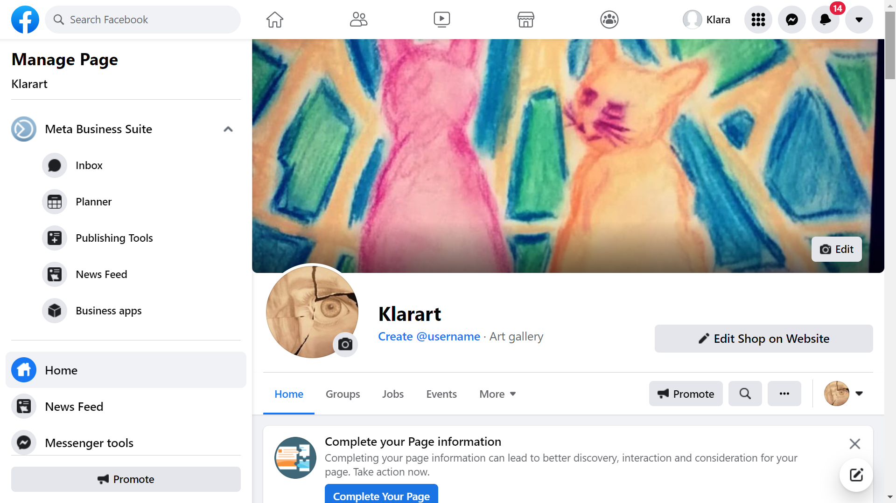
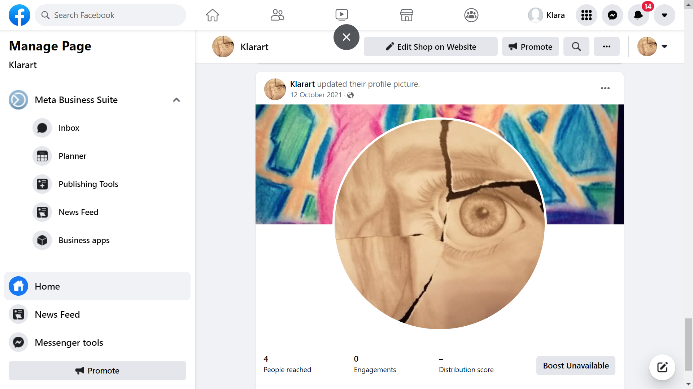
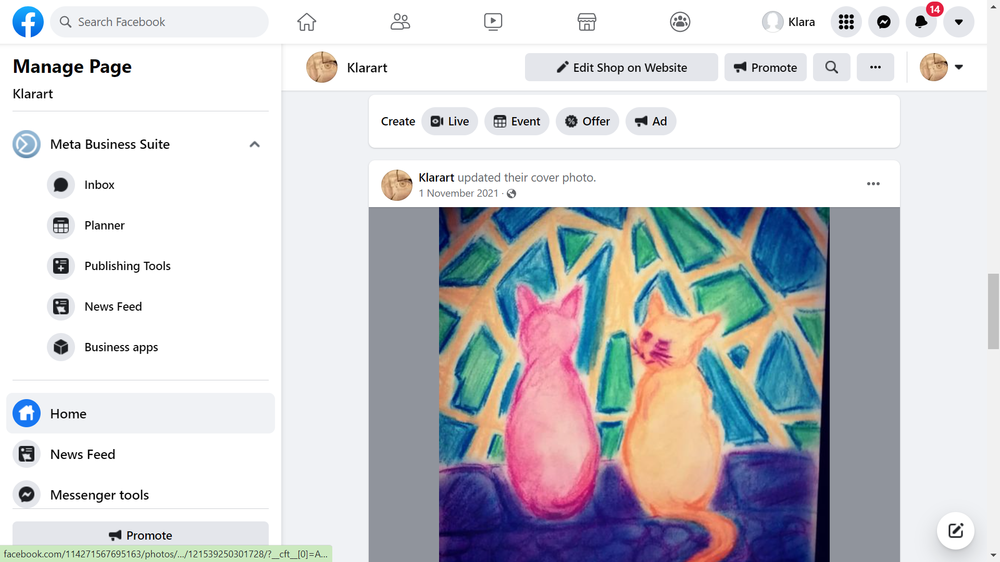
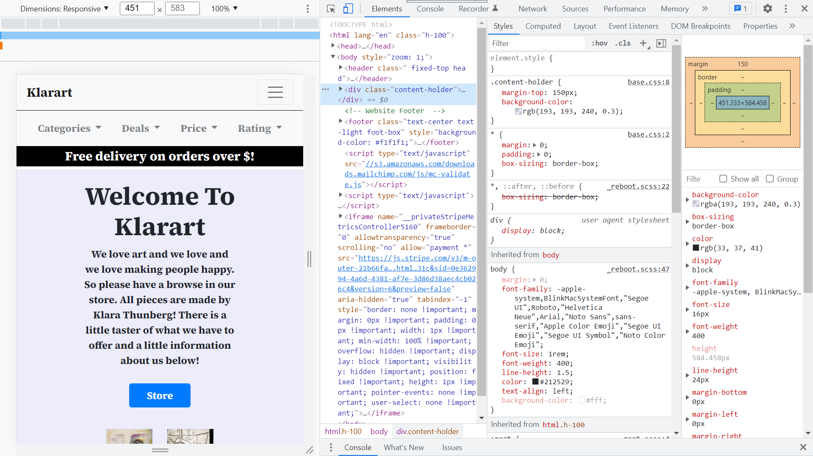

# E-Store()

# Introduction
This is PP-5 for Code Institute and for this I decided to create an E-commerce store for my Partner as she is an artist. This project will one day turn into a viable business for Myself and my Partner. Some of the code for this project came from a previous attempt at creating an E-commerce site, it will be linked to in the sources section of this file. Check the keys below and checkout various sections in this readme file. If anybody reading this has any questions please don't hesitate to get in touch with me at benjaminjoe43@gmail.com.

## Keys

1. [Setup](#setup)
2. [Build](#build)
3. [Installations](#installations)
4. [Marketing](#marketing)
5. [Testing](#testing)
6. [User Stories](#userstories)
7. [Sources](#sources)
8. [Deployment](#deployment)
9. [Wireframes](#wireframes)

# Build
During the build process I was able to move over some existing code from my previous attempt at this project, this helped save some time and allowed me to focus on other areas, mainly authentication areas of the website. Please check the sources section for a link to the old repo.

# Installations
In order to complete this project, quite a few imports were needed, they are all listed below:  
[Python](https://www.python.org/)  
[Django](https://docs.djangoproject.com/en/4.0/)  
[Allauth](https://django-allauth.readthedocs.io/en/latest/installation.html)  
[Pillow](https://pillow.readthedocs.io/en/stable/)  
[Crispy-forms](https://django-crispy-forms.readthedocs.io/en/latest/)  
[Stripe](https://stripe.com/en-se)

# Marketing
The type of clients that this website is aimed at is middle aged women for the most part. This is due to testing. My partner, the artist behind the designs hosted a number of art galleries this year and the majority of customers who purchased items were middle aged women, and also middle aged men buying gifts for their wifes/partners. So in order to best market these products to our clientele we created a business page on facebook, as a lot of the people who purchased items also inquired if our company was on Facebook. We do also have an instagram as it is a great way to advertise to a younger audience. Both links to facebook and instagram are in the footer of this website. Just  incase the facebook business page is no longer valid below are some images of the facbook business page. Another marketing strategy we are using is offering a monthly email keeping our customers up to date with all new items and deals. This too is located in the footer of the website. It only requires an email address to sign up so it is very quick and easy. The final marketing thing we intend to employ is prizes and giveaways. We want to reward customers for their purchases so we intend to imploment discounts and prizes to lucky customers. 
      
      
    

# Testing  
Creating this website meant tests, and lots of them. I tested my code in multiple ways:
Chrome Dev Tools:  
These helped me out so much throughout the build process as they allowed me to see any issues in real time and have complete control on how things were shaping up, Below is a screenshot of the chrome dev tools  
      
I also made good use of the lighthouse ability within chrome developer tools. This helped me see where possible running problems could be and also it gave me tips on how to speed up the website by making a few minor changes.

# Wireframes  
In order to help me create the site I used Balsamiq Wireframes. These helped me to have some sort of rough idea of what I wanted to build. These proved to be very helpful in keeping me on the right track and allowed me to break the website down into sections, preventing the workload from getting overwhelming. The wireframs are picture below:  
